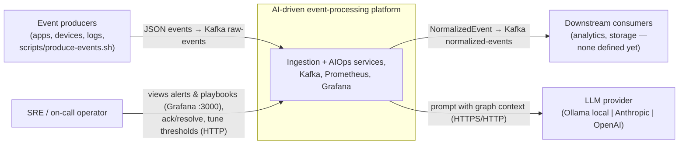
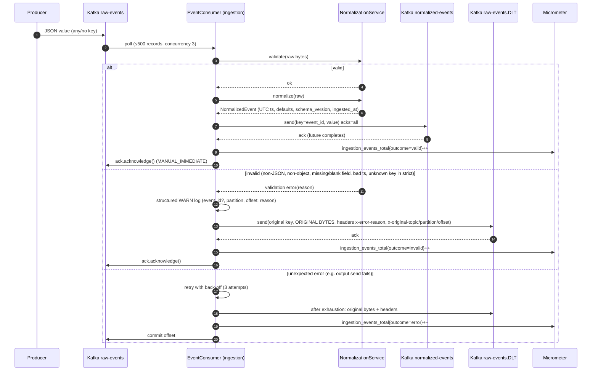
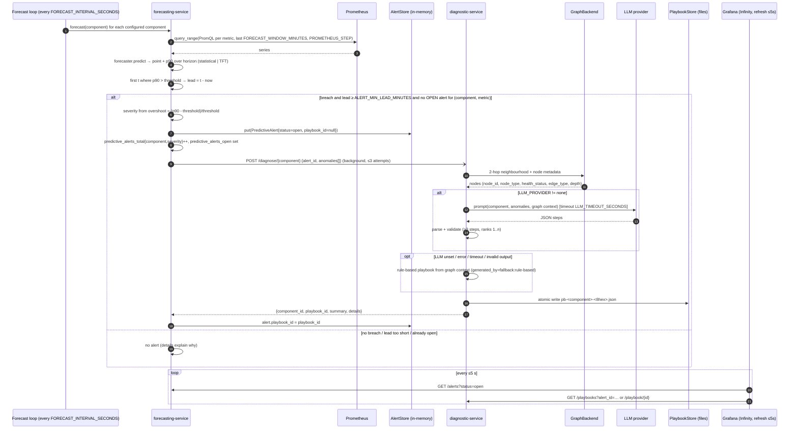

# Architecture

> Binding interfaces live in [`CONTRACTS.md`](CONTRACTS.md), and machine-readable schemas in [`../contracts/`](../contracts/). Decisions and their rationale are in [`adr/`](adr/README.md). This document describes how the pieces fit together and how they behave when something breaks. Where it adds detail, that detail is consistent with CONTRACTS.md. Items marked **(recommended)** are guidance that does not change any interface.

## 1. Scope and drivers

The platform has two independent paths:

| Path | Purpose | Requirements | Character |
|---|---|---|---|
| **Data path** | Ingest, validate and normalise high-volume events | REQ-A, B, C | Throughput-critical, at-least-once, Kafka-native, stateless |
| **AIOps path** | Predict component failures and draft remediation | REQ-D … I, K | Low volume, latency-tolerant (seconds), AI-dependent, must degrade gracefully |

Main architectural drivers:

1. The data path must never depend on the AIOps path.
2. The AIOps path must *always* produce an answer (statistical forecast, rule-based playbook) even when its AI components are missing.
3. The whole system must run on a laptop and pass CI with no GPU, no LLM and no network.

## 2. System context (C4 level 1)



## 3. Containers (C4 level 2)

```mermaid
flowchart TB
    subgraph kafka_box["Kafka (kafka:29092 / host :9092) + ZooKeeper"]
        raw[["raw-events (6p)"]]
        norm[["normalized-events (6p, key=event_id)"]]
        dlt[["raw-events.DLT (1p)"]]
    end

    ing["ingestion-service :8080<br/>Java 17 · Spring Boot 3 · Spring Kafka<br/>validate → normalise → route"]
    prom[("Prometheus :9090<br/>scrape 15s · rules: infra/prometheus/rules")]
    fc["forecasting-service :8081<br/>Python 3.11 · FastAPI<br/>forecaster (statistical | TFT)<br/>threshold eval · in-memory AlertStore"]
    dg["diagnostic-service :8082<br/>Python 3.11 · FastAPI<br/>GraphRAG: graph backend + LLM<br/>rule-based fallback"]
    graph[("Dependency graph<br/>networkx (seed JSON, default)<br/>| Neo4j :7687 (profile neo4j)")]
    store[("Playbook store<br/>PLAYBOOK_STORE_DIR/*.json")]
    cfg[/"config/components.yaml<br/>(hot-reloaded)"/]
    llm["LLM<br/>Ollama :11434 (profile llm)<br/>| hosted API | none"]
    graf["Grafana :3000<br/>Prometheus DS + Infinity DS"]

    raw --> ing
    ing -- valid --> norm
    ing -- "invalid / exhausted retries" --> dlt

    prom -- "scrape /actuator/prometheus" --> ing
    prom -- "scrape /metrics" --> fc
    prom -- "scrape /metrics" --> dg

    fc -- "query_range (PromQL)" --> prom
    cfg -.-> fc
    fc -- "POST /diagnose/{component}<br/>(3 attempts)" --> dg
    dg --> graph
    dg --> llm
    dg --> store

    graf -- "PromQL" --> prom
    graf -- "GET /alerts (Infinity)" --> fc
    graf -- "GET /playbooks, /playbook/{id} (Infinity)" --> dg
```

### Container responsibilities

| Container | Owns | Does **not** own |
|---|---|---|
| ingestion-service | Raw-event validation rules, normalisation, DLT routing, offset commits | Any AIOps concern. It only emits metrics. |
| forecasting-service | Metric retrieval, forecasting, thresholds (runtime-editable), `PredictiveAlert` lifecycle, alert → playbook link | Root-cause analysis, playbook content |
| diagnostic-service | Dependency graph access, prompt assembly, LLM invocation, fallback generation, playbook persistence | Alert lifecycle, deciding *when* to diagnose |
| Prometheus | Time-series storage, recording/alerting rules | Business state |
| Grafana | Presentation (REQ-K) | Any state (read-only over APIs) |

Internal structure of each Python service (**recommended**, ports and adapters only where a real substitution exists):

```
api (FastAPI routes) ──► domain (engine, models, severity rules) ──► ports
                                                                   ├─ MetricSource      → Prometheus adapter
                                                                   ├─ Forecaster        → statistical | TFT          (ADR-0002)
                                                                   ├─ AlertStore        → in-memory                  (ADR-0007)
                                                                   ├─ DiagnosticClient  → httpx                      (ADR-0001)
                                                                   ├─ GraphBackend      → networkx | neo4j           (ADR-0003)
                                                                   ├─ LLMProvider       → ollama | anthropic | openai | none (ADR-0004)
                                                                   └─ PlaybookStore     → JSON files                 (ADR-0005)
```

Domain code (severity bands, lead-time gate, rank validation, fallback rules) must not import FastAPI, httpx, torch or neo4j. That keeps it testable with no network and no ML dependencies (CONTRACTS.md §6).

## 4. Domain model

| Concept | Owner | Identity | Lifecycle / invariants |
|---|---|---|---|
| RawEvent | producers | `event_id` (producer-assigned, not guaranteed unique) | Immutable. Valid or invalid. |
| NormalizedEvent | ingestion | `event_id` | Immutable. `timestamp` in UTC, `schema_version="1.0"`. |
| PredictiveAlert | forecasting | `al-<12hex>` | `open → acknowledged → resolved` (also `open → resolved`). At most one `open` per (component, metric). Emitted only if lead ≥ `ALERT_MIN_LEAD_MINUTES`. |
| IncidentPlaybook | diagnostic | `pb-<component>-<8hex>` | Immutable once stored. ≥ 3 steps ranked 1..n. Optionally linked to an `alert_id`. |
| Dependency node / edge | diagnostic (seed) | node `id` | Static seed. 2-hop neighbourhood is the retrieval unit. |

The link between the two AIOps contexts is **one-way and by reference**. The alert holds `playbook_id`, and the playbook holds `alert_id`. Neither service reads the other's store.

## 5. Runtime views

### 5a. Event ingestion, including the DLT path (REQ-A/B/C)



Key properties:

- **At-least-once.** The offset is committed only after the downstream (output or DLT) send has been acknowledged. A crash between the send and the ack causes a redelivery, so `normalized-events` can contain duplicates. Consumers must de-duplicate on `event_id`.
- **Poison pills never block a partition.** They are dead-lettered and then acked.
- **DLT partitioning.** `raw-events.DLT` has **1** partition while `raw-events` has 6. Spring's `DeadLetterPublishingRecoverer` publishes to the *same partition number* by default, which would fail for records from partitions 1–5. The destination resolver therefore uses partition `-1` (the producer picks), as `KafkaConfig` does. The original partition is preserved in `x-original-partition`.
- **One DLT writer format.** Validation rejections (sent by the consumer) and exhausted retries (sent by the error handler's recoverer) both build their headers in `DeadLetters`, so DLT records look the same whichever path produced them.
- Spring's default `kafka_dlt-*` headers may also be present. The contract only requires the four `x-*` headers.

### 5b. Forecast → alert → diagnose → playbook → dashboard (REQ-D … K)



Notes:

- `POST /forecast` runs the same pipeline on demand and returns `{component_id, alert_emitted, alert, details}`.
- `PUT /thresholds/{component_id}` updates the in-memory thresholds, which the next cycle uses (REQ-F). `config/components.yaml` is re-read when its mtime changes. **Recommended precedence:** a file reload replaces only the file-sourced values, and API overrides stay until the process restarts (or until the AI Engineer documents another rule, see §10).
- A diagnose call that fails 3 times leaves the alert open with `playbook_id=null`. The dashboard shows it without a link, and an operator can call `POST /diagnose/{component_id}` with the `alert_id` manually.

## 6. Quality attributes → acceptance criteria

| REQ | Acceptance criterion | Architectural tactic | How it is verified |
|---|---|---|---|
| REQ-A | Consumer lag < 500 ms at 10 000 ev/s | 6 partitions × concurrency 3, batch poll 500, stateless consumer, HPA on ingestion. Lag via `kafka_consumer_fetch_manager_records_lag_max`. | Load test with `scripts/produce-events.sh` (Phase 5). The SLO and alert rule are in `docs/SLO.md` and `infra/prometheus/rules`. |
| REQ-B | Malformed events rejected with structured logs and sent to the DLT | Validation before normalisation. DLT keeps original bytes plus reason headers. `outcome=invalid` counter. | Unit tests per invalid class. The integration test asserts a DLT record and its headers. |
| REQ-C | All NormalizedEvent fields populated correctly | Pure mapping function, UTC conversion, explicit defaults | Unit tests checked against `contracts/normalized-event.schema.json` |
| REQ-D | Forecast latency < 2 s for a 60-min window | Statistical forecaster by default (ADR-0002). Bounded window and step. `forecast_latency_seconds` histogram. | Unit timing test. `histogram_quantile(0.95, forecast_latency_seconds)` < 2 s. |
| REQ-E | Alert ≥ 10 min before the predicted breach | p90 band, lead-time gate `ALERT_MIN_LEAD_MINUTES=10`, severity bands | Synthetic ramp series in tests: assert an alert with lead ≥ 10 and the correct severity |
| REQ-F | Threshold change without redeploy | `PUT /thresholds` plus hot-reloaded `components.yaml` | Test: PUT, then the next forecast uses the new threshold |
| REQ-G | Context < 1 s for ≤ 500-node graphs | In-process networkx 2-hop BFS (ADR-0003). `graph_context_seconds`. | Test with a generated 500-node graph |
| REQ-H | ≥ 3 ranked steps | Schema-validated LLM output, deterministic fallback (ADR-0004) | Tests with `LLM_PROVIDER=none`, plus a mocked LLM returning bad, short and good outputs |
| REQ-I | Structured JSON, linked to alertId | File store (ADR-0005), `alert_id` in the playbook, `playbook_id` on the alert (ADR-0001) | Round-trip test with `tmp_path`. `GET /playbooks?alert_id=`. |
| REQ-K | New alert visible ≤ 5 s, alert links to its playbook | Grafana + Infinity polling at ≤ 5 s, data link on `playbook_id` (ADR-0006) | Manual/E2E: trigger an alert, time it to visible |

Cross-cutting: **availability of the data path is independent of the AIOps path.** Each service has `/health` (liveness: the process is up) and `/ready` (readiness: dependencies needed to serve are usable). **Recommended `/ready` semantics:** forecasting is ready once config has loaded (a Prometheus outage does not make it unready, see §7). Diagnostic is ready once the graph has loaded. An LLM outage does not make it unready.

## 7. Failure modes and degradation

| Failure | Detected by | Behaviour | User-visible effect |
|---|---|---|---|
| **LLM down / slow / garbage** | timeout, HTTP error, parse or validation failure. `llm_failures_total{provider}` | Rule-based playbook (`generated_by=fallback:rule-based`), `diagnoses_total{outcome="fallback"}` | A playbook is still produced (REQ-H holds), but generic. A Prometheus rule should warn on a sustained fallback rate. |
| **Prometheus down** | query errors. `forecast_runs_total{outcome="error"}` | Cycle for that component fails fast (bounded HTTP timeout). Loop continues. No alerts are created from missing data. Existing alerts are untouched. | No *new* predictive alerts. Metric panels are empty. The data path is unaffected. Self-monitoring is weak here because the metrics needed to notice the outage live in Prometheus itself, so check `up` from outside (Grafana's health check). |
| **Prometheus returns too little history** (new component, no exporter) | series shorter than the minimum | Treat as "insufficient data". Outcome `ok`, no alert, reason in `details`. | Component never alerts. See §10 on components without exporters. |
| **Kafka down** | consumer and producer errors, `/actuator/health` | Consumer keeps retrying the connection. Nothing is committed, so nothing is lost: on recovery, consumption resumes from the last committed offset. Producer sends fail, then retry, then error outcome. | Ingestion stalls and lag grows. The AIOps path continues, and the stall should itself be predicted or detected. |
| **Kafka up, output topic send fails** | send future exception | Retry 3× with back-off, then DLT (`outcome=error`), then ack | Event is preserved in the DLT for replay |
| **Graph DB (Neo4j) down** | driver error. `diagnoses_total{outcome="error"}` | **Recommended:** fall back to the networkx seed graph (`GRAPH_SEED_PATH`) and flag `details.graph_backend="networkx-fallback"`. Otherwise return 5xx. | Playbook based on seed topology (static health) |
| **Component not in graph** | lookup miss | `404` (contract). forecasting must **not** retry a 404. | Alert has no playbook. Fix: add the node to the seed. |
| **diagnostic-service down** | connection error after 3 attempts | Alert kept, `playbook_id=null`, warning logged | Alert shows on the dashboard without a playbook link |
| **forecasting-service restart** | — | In-memory alerts lost (ADR-0007). Next cycle re-alerts with new ids. | Brief gap. Ack state is lost. |
| **Playbook volume full / unwritable** | write exception | `diagnoses_total{outcome="error"}`, 5xx to the caller | Playbook missing. Alert remains. |
| **Grafana down** | — | No effect on the services | No dashboard. The APIs remain usable. |

Design rule: **every outbound call has a timeout** (Prometheus, diagnostic, LLM, Neo4j). The forecast loop isolates failures per component, so one bad component never stops the others.

## 8. Scaling model

| Container | Scale unit | Ceiling / constraint | Notes |
|---|---|---|---|
| ingestion-service | pods in consumer group `ingestion-consumer-group` | ≤ 6 *useful* consumer threads per topic (6 partitions × concurrency 3 ⇒ 2 pods saturate them) | To scale beyond this, **increase `raw-events` partitions first**. The HPA range (2–6 pods) only helps once partitions ≥ pods × concurrency. Scale on lag (Phase 5), not CPU. |
| forecasting-service | **1 replica** (ADR-0007) | In-memory store, singleton loop | The HPA (1-5) must be capped at 1. Scale-out needs a shared store plus leader election. Vertical scaling suffices: about 24 series per cycle. |
| diagnostic-service | **1 replica** (ADR-0005) | Single-writer file store | Throughput is LLM-bound (seconds per call) at a few calls an hour, so one replica is ample. Multi-replica needs a shared store. |
| Prometheus | single | local TSDB | Standard. |
| Kafka | brokers / partitions | Single broker locally (RF=1) | Production: ≥ 3 brokers, RF=3, `min.insync.replicas=2` to give `acks=all` its meaning. |

Ordering: `normalized-events` is keyed by `event_id`, so per-producer order is **not** preserved across partitions. That is accepted: events carry their own timestamp.

## 9. Security notes

- **Trust boundary.** Everything inside the compose network or k8s namespace is trusted. No service authenticates HTTP callers. Grafana and the services must not be exposed publicly as-is. Production path (Phase 5): mTLS or a service mesh between services, and an API gateway with auth for `PUT /thresholds`, ack/resolve and `POST /diagnose`.
- **Secrets.** `LLM_API_KEY` and `GRAPH_DB_PASSWORD` come from env (k8s Secrets) and are never logged or written into playbooks or `details`. The compose default `changeme` is for local use only. The Grafana admin password should be set via env.
- **LLM data egress.** Prompts contain internal topology, owner teams and versions. With `anthropic`/`openai` that data leaves the network, so use `ollama` for sensitive environments.
- **Prompt injection and output handling.** Anomaly data and graph metadata are interpolated into prompts. Treat LLM output as untrusted: validate against the schema, cap lengths, and never execute `command`. The rendered markdown must be escaped when displayed in Grafana.
- **Path traversal.** `playbook_id` maps to a file name. Validate it against `^pb-[a-z0-9][a-z0-9-]*-[0-9a-f]{8}$` before building paths, and restrict `component_id` in path parameters to `^[a-z0-9][a-z0-9-]*$`.
- **Input size.** Raw events are untrusted. Kafka `max.message.bytes` bounds size. Strict validation limits top-level shape only, and `payload` is opaque.
- **Containers.** Non-root, read-only root filesystem where possible. The only writable volume is the playbook store.

## 10. Deliberate trade-offs and open points

Trade-offs taken (details in the ADRs):

| We chose | Over | Giving up |
|---|---|---|
| HTTP hand-off (0001) | Kafka alerts topic | Durability of the hand-off, fan-out to other consumers |
| Statistical default (0002) | TFT-only | Forecast accuracy on complex seasonality, until TFT is trained |
| networkx seed (0003) | Neo4j/Neptune by default | Live topology and health, multi-writer graph |
| Rule-based fallback (0004) | Fail when the LLM fails | Quality of fallback playbooks (generic) |
| File store (0005) | Database | Multi-replica writes, querying |
| Grafana + Infinity (0006) | Custom UI | Rich interaction (ack buttons, custom layout) |
| In-memory alerts (0007) | Durable store | Restart durability, horizontal scale |

Points the contract leaves open (implementers pick **consistent** behaviour and document it; none of them changes an interface):

1. **`anomalies[]` item shape** in the `/diagnose` body. Recommended: `{"metric_name", "predicted_value", "threshold", "predicted_breach_time", "severity"}`, so diagnostic can put them into the prompt and the fallback rules.
2. **`predicted_value`** is the **peak** p90 value in the horizon (the value the severity is computed from); `predicted_breach_time` is the first crossing, or *now* when already breaching. Late breaches (lead < `ALERT_MIN_LEAD_MINUTES`) are still alerted. **Overshoot** = `(predicted_value − threshold) / threshold`. For `threshold == 0` (e.g. error rate), treat any breach as `critical` (or guard with `max(threshold, ε)`).
3. **"One OPEN alert per (component, metric)".** Recommended: an `acknowledged` alert also suppresses new ones until it is resolved. Otherwise acking an alert immediately causes a duplicate on the next cycle.
4. **Retry semantics** ("3 attempts"). The ingestion error handler implements it as 3 *retries* after the first delivery (`app.kafka.retry.max-retries: 3`, exponential back-off 500 ms → 5 s), so 4 deliveries in total. For the diagnose hand-off, read it as 3 attempts in total. Both readings comply with the contract. Never retry a 4xx (validation errors are dead-lettered immediately, and a diagnose 404 is final).
5. **Idempotent diagnose.** Recommended: if a playbook already exists for the given `alert_id`, return it instead of generating a new one, so retries do not create orphans.
6. **`GET /playbooks` item shape.** Recommended: full `IncidentPlaybook` objects, newest first, so Infinity can use the same parser for list and detail.
7. **Explicit `null` for optional raw fields** (`type`, `component_id`, `payload`). The schema rejects them as written. If ingestion chooses to treat `null` as absent, `contracts/raw-event.schema.json` must be widened together with an ADR.
8. **Monitored components without exporters.** `kafka`, `zookeeper`, `graph-db` and `llm` expose no CPU/memory/error-rate series in the current Prometheus config (the Kafka JMX job is commented out). `config/components.yaml` should either map them to metrics that exist (e.g. `up{job=…}`, or the ingestion lag metric for `kafka`) or mark them forecast-disabled. The graph seed must still contain **all 8 ids**, or diagnose returns 404.
9. **Dependency direction for 2-hop retrieval.** Recommended: traverse **both** directions (what the component depends on *and* what depends on it), with `edge_type` reported as stored. Root causes are usually downstream, and blast radius is upstream.
